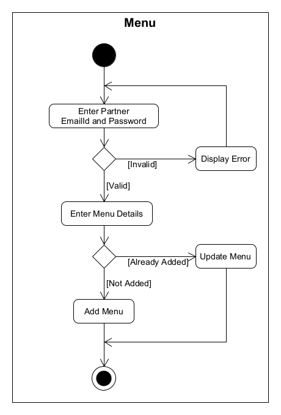

**BILLY**

A project submitted to

**UKA TARSADIA UNIVERSITY**

in partial fulfillment of the requirements for the degree of

**Master of Science**

in

**Information Technology**

for 

**5 Years Integrated M.Sc. (IT)**

By

**CHOKSI ABHISHEK PREMALKUMAR**

(201906100110032)

**And**

**PATEL MEET DHIRAJBHAI** 

(201906100110015)

Guided by

**Ms. Jigna Solanky**

**Assistant Professor**

**Babu Madhav Institute of Information Technology**

**Uka Tarsadia University**

**Bardoli – 394350**

`	`**November 2022**
(201906100110032, 201906100110015)

**Acknowledgment**

The satisfaction that accompanies the successful completion of this project would be incomplete without mentioning the people who made it possible, without whose constant guidance and encouragement would have made efforts go in vain. I consider myself privileged to express gratitude and respect towards all those who have guided me through the completion of projects. 

I convey thanks to my project guide, **Ms. Jigna Solanky**, for his encouragement, constant support, and guidance which was of great help to complete this project work successfully. 

I am grateful to **Dr. Jitendra Nasriwala**, Head of the Department, Babu Madhav Institute of Information Technology, **BMIIT** for giving us the support and encouragement that was necessary for the completion of this project. 

I would like to thank all the faculty members for their patience, understanding, and guidance that gave me the strength and willpower to work through the long tedious hours of developing a project and preparing the report. 

Last but not the least, I would also like to thank my colleagues, who give their ideas and helped me a lot to improve my project.

**Table of Content**

|**Chapters**|**Particulars**|**Page No.**|
| :-: | :-: | :-: |
|**1**|**Introduction**|**1-3**|
||1.1|Problem Definition|1|
||1.2|Initial Requirement Document|1|
||1.3|Project Objective|3|
||1.4|Product Scope|3|
||
|**2**|**Overall Description**|**4**|
||2.1|Product Perspective/ Environment Description|4|
|||2.1.1|Hardware Interface/ Hardware Specification|4|
|||2.1.2|Software Interface/ Software Specification|4|
||
|**3**|**System Planning**|**4-5**|
||3.1|Software Engineering Model|4|
||
|**4**|**System Specific Requirements**|**6-17**|
||4.1|Functional Requirement|6|
||4.2|Non-functional Requirement|17|
||
|**5**|**System Analysis** |**18-25**|
||5.1|Use case Diagram|18|
||5.2|Activity Diagrams|22|
||
|**6**|**System Design**|**26-29**|
||6.1|Database Design|26|
|||6.1.1|Database Schema|26|
||
|**7**|**Future Enhancement**|**30**|
||||
||**Conclusion**|**30**|
||||
||**Bibliography**|**30**|

**List of Figures**

|**Figure no.**|**Figure Description**|**Page no.**|
| :-: | :-: | :-: |
|5.1.1|Use Case Diagram for Billy Admin|18|
|5.1.2|Use Case Diagram for Billy Partner|19|
|5.1.3|Use Case Diagram for Billy Customer|20|
|5.1.4|Use Case Diagram for Billy Delivery Boy|21|
||
|5.2.1|Activity Diagram for User Registration|22|
|5.2.2|Activity Diagram for Menu|23|
|5.2.3|Activity Diagram for Checkout|24|
|5.2.4|Activity Diagram for Change Password|25|

**1. Introduction**

1.1 Problem Definition

In earlier days, all restaurants can use manual ways to store their data and records so maintaining a large amount of data was difficult. They need full function software to maintain their day-to-day life transaction, order, cash transaction, and customer feedback. Because of large data, they need some features or systems which can maintain and store the data or records accurately. The Billy reduces manual work and improves the efficiency of the store. To remove all the disadvantages of conventional methods, a system is proposed which is a **Billy**.

1.2 Initial Requirement Document

**Initial Requirement Document Billy**

|Title of the project|Billy|
| - | - |
|Stakeholders involved in capturing requirement|Owner, Project Guide, Customer, Partners|
|Techniques used for requirement capturing|Brainstorming|
|Name of the person along with a designation|-|
|Date|July 2022|
|Users of the system|Admin, Delivery Boy, Customer, Partners, Visitor|
|Version|3.0|
|**Consolidated list of initial requirements:**|
|Req #1|The system shall be allowed to authenticate to the admin, Partners, Customer, and Delivery Boy to register into the system.|
|Req #2|The admin shall be able to manage the Cuisines.|
|Req #3|The admin shall be able to approve or reject the restaurant after checking the restaurant documents.|
|Req #4|The admin shall be able to approve or reject the menu (category, item, added on, add extra).|
|Req #5|The admin shall be able to manage the delivery boy.|
|Req #6|The admin shall be able to manage the Customer.|
|Req #7|The admin shall be able to manage the Help.|
|Req #8|The admin shall be able to view all the customer orders.|
|Req #9|The admin shall be able to manage the questions.|
|Req #10|The admin shall be able to view the rating of a particular item or a restaurant.|
|Req #11|The admin shall be able to manage complaints.|
|Req #12|The admin shall be able to manage the referral amount.|
|Req #13|The partner shall be able to view orders details like (new orders, preparing orders, ready orders, and past orders)|
|Req #14|The partner shall be able to the manage category.|
|Req #15|The partner shall be able to the manage item.|
|Req #16|The partner shall be able to the manage added-on.|
|Req #17|The partner shall be able to the manage added extra.|
|Req #18|The partner shall be able to see their profile and also edit them.|
|Req #19|The partner shall be able to see menu history like (in-review, approved, canceled)|
|Req #20|The partner shall be able to manage the banner.|
|Req #21|The partner shall be able to manage the setting.|
|Req #22|The partner shall be able to communicate with Billy’s admin using Help.|
|Req #23|The partner shall be able to see all the customer reviews.|
|Req #24|The partner shall be able to set the order status and also allocate the delivery boy.|
|Req #25|The partner shall be able to View the matric(report).|
|Req #26|The customer shall be able to view the cuisines and select the cuisines on the home page.|
|Req #27|The customer shall be able to view the latest offers banner and also view the top 10 products on the home page.|
|Req #28|The customer shall be able to view the cuisines name, Description, and cuisines banner on the Restaurant page.|
|Req #29|The customer shall be able to view all the restaurants based on the cuisines selected by the customer.|
|Req #30|The customer shall be able to filter the restaurant rating-wise. |
|Req #31|The customer shall be able to view items based on the category on the menu page.|
|Req #32|The customer shall be able to view and search (filter) the item price-wise, rating wise and item-type-wise (Veg/Non-Veg/Egg).|
|Req #33|The customer shall be able to customize the menu, like (adding or removing added-on, add extra, and variants).|
|Req #34|The customer shall be able to manage the cart by adding the item in the cart, updating the quantity, or removing the item and customizing (added-on, add extra, and variant).|
|Req #35|At checkout time customer change their shipping address and also add a new shipping address.|
|Req #36|The customer shall be able to make payment using one of the online payment gateways, through cash on delivery, or using the wallet.|
|Req #37|The system shall be able to generate the bill and the customer also downloads the bill in pdf format.|
|Req #38|The customer shall be able to cancel the order if the order status is pending.|
|Req #39|The customer shall be able to view the order status. (Like pending, cooking, on the way, delivered)|
|Req #40|The customer shall be able to get the mail for their order.|
|Req #41|The customer shall be able to view previous(past) order history and also download the pdf of that.|
|Req #42|The customer shall be able to give feedback.|
|Req #43|The customer also adds an item to the wish list and later they can view their like item and order it.|
|Req #44|The customer shall be able to edit their account.|
|Req #45|The customer shall be able to change their password and set a new password.|
|Req #46|The customer also has forgotten the password facility. |
|Req #47|The delivery boy shall be able to view the order detail and which order allocate to that delivery boy.|
|Req #48|The delivery boy shall be able to update the payment status if the payment is pending.|
|Req #49|The delivery boy shall be able to update the order status and set the order status delivered.|
|Req #50|
The system should be able to generate reports like:

1. Categories of complaints

&emsp;a. Wrong Item

&emsp;b. Missing Item

&emsp;c. Quality & Quantity Issues

&emsp;d. Package Spillage

&emsp;e. Late Delivery

2. Accepted Orders

3. Canceled Orders

Status of all customer’s orders (Day/Date, Weekly, Monthly, Yearly)
|

1.3 Project Objective

- To reduce the cost of the business operation.
- To improve the customer service.
- To simplify the workflow.
- To save the environment.
- This will be adding on benefit for the customers as it will save their time, plus it adds on for the owner also.

1.4 Product Scope

The user first registration into the system and then the customer can buy food from the billy. The system will deliver food only to Bardoli city. The scope of this system is confined to one city and involves multiple customers and partners. This system is a multi-restaurants system, allowing customers to buy and browse items from various restaurants.

**2. Overall Description**

**2.1 Product Perspective/Environment Description**

`	`2.1.1 Hardware Interface/Hardware Specification

|CPU:|Intel Core Pentium|
| :- | :- |
|HDD Space:|120 GB HDD|
|RAM:|4 GB RAM|

2.1.2 Software Interface/Software Specification

|Operating System:|Multi-Platform (Window, IOS, Linux, Web Server)|
| :- | :- |
|Front-end Technology:|React JS, Flutter, HTML, CSS, Bootstrap, JavaScript, jQuery|
|Back-end Technology:|Node JS, Express JS, MongoDB|
|Other Tool:|
Visual Studio Code, MongoDB Compass, Postman,

Android Studio, Android Virtual Device, XCode, IOS Simulator
|

**3. System Planning**

**3.1 Software Engineering Model**

This system follows **Spiral Model**.

- **Why do we use Spiral Model?**
  - An evolutionary software process model that couples the iterative nature of prototyping with the controlled and systematic aspects of the Waterfall Model.
  - Provides the potential for rapid development of an increasingly more complex version of the Software.
  - Using this, Software is developed in a series of evolutionary releases.
  - During early iteration, the release may be a paper model or prototype.
  - During later iterations, an increasingly more complete version of the engineered system is produced.
  - Each of the framework activities represents one segment of the Spiral Model.
  - The spiral work in a clockwise direction beginning at the center.

**[Figure: Spiral Model]**

**Advantage of Spiral Model:**

The advantage of using the spiral model is varied. Its design flexibility allows changes to be implemented at several stages of the project.

Provides a working model to the user early in the process, enabling early assessment and increasing the user's confidence.

The developer gains experience and insight by developing prototyping thereby resulting in better implementation of requirements.

**4. System Specific Requirements**

**4.1 Functional Requirement**

4.1.1.	Functional requirement for Manage User login

|**RN**|**Description**|**Comments**|
| :-: | :-: | :-: |
|**FR1**|This Module will be managed by Admin, Partner, Delivery Boy, and Customer.|User Login Page|
|**FR2**|This Module accepts the password which will be created by the user.|User Login Page|
|**FR3**|This Module also provides the functionality of forgot passwords for changing user passwords.|User Login Page|

4.1.2.	Functional requirement for Manage Cuisines

|**RN**|**Description**|**Comments**|
| :-: | :-: | :-: |
|**FR1**|This Module will be managed by Admin.|Cuisines Page|
|**FR2**|The system will assign a unique id (Cuisines ID) to each Cuisines.|Add Cuisines Page|
|**FR3**|
Whenever any new Cuisines arrives, the admin is allowed to record the following details of the Cuisines Like ...

Cuisines name, Cuisines image, Cuisines Description and Cuisines Banner.
|
Add Cuisines Page

|
|**FR4**|
To manage this module, the admin will be able to perform the following operations:

- Add new Cuisines

- Update an existing Cuisines
|
Add Cuisines Page

Update Cuisines Page
|
|**FR5**|
To manage this module, the admin will be able to perform the following operations:

- Active/De-active Cuisines

- View/Search Cuisines
|View/Search and Active/Deactivate Cuisines Page |

4.1.3.	Functional Requirement for Manage Restaurant

|**RN**|**Description**|**Comments**|
| :-: | :-: | :-: |
|**FR1**|This Module will be managed by Partner.|Restaurant Page|
|**FR2**|The system will assign a unique id (Restaurant ID) to each Restaurant.|Add Restaurant Page|
|**FR3**|
Whenever any new Item arrives, the Partner is allowed to record the following details of the Restaurant Like ...

Restaurant name, Restaurant image, Restaurant Address, Restaurant City, Restaurant Contact, Owner name, Owner Contact, owner Email Id, Owner Password.
|Add Restaurant Page|
|**FR4**|
After restaurant verified by admin, the Partner is allowed to record the following details of the Restaurant Like ...

Documents (GST Certificate, FSSAI Certificate, Sample Bill, Sample Menu, Owner Pan card), Restaurant timing, cuisines id.
|Restaurant Registration Page|
|**FR4**|
To manage this module, the Partner will be able to perform the following operations:

- Add new Item

- Update an existing Item
|
Add Restaurant Page 

Update Restaurant Page
|
|**FR5**|
To manage this module, the Partner will be able to perform the following operations:

- Active/De-active Item

- View/Search Item
|View Search Active/Deactivate Restaurant Page|

4.1.4.	Function requirement for Manage Category

|**RN**|**Description**|**Comments**|
| :-: | :-: | :-: |
|**FR1**|This Module will be managed by Partner.|Category Page|
|**FR2**|The system will assign a unique id (category ID) to each category.|Add category Page|
|**FR3**|
Whenever any new Category arrives, the Partner is allowed to record the following details of the Category Like …

Category name. 
|Add category Page|
|**FR4**|
To manage this module, the Partner will be able to perform the following operations:

- Add new Category

- Update an existing Category

- Delete an existing Category
|
Add category Page 

Update category Page

Delete category Page
|
|**FR5**|
To manage this module, the Partner will be able to perform the following operations:

- Active/De-active Category

- View/Search Category
|View/Search and Active/Deactivate category Page|

4.1.5.	Functional Requirement for Manage Added On

|**RN**|**Description**|**Comments**|
| :-: | :-: | :-: |
|**FR1**|This Module will be managed by Partner.|Added-on Page|
|
**FR2**

|The system will assign a unique id (added-on id) to each added-on.|Add Added-on Page|
|**FR3**|
Whenever any new added-on arrives, the partner is allowed to record the following details of the added-on Like ...

Added-on id with its restaurant id, Name, Type, Price, Additional Price, Final Price
|Add Added-on Page|
|**FR4**|
To manage this module, the Partner will be able to perform the following operations:

- Add new Added-on

- Update an existing Added-on
|
Add Added-on Page 

Update Added-on Page
|
|**FR4**|
To manage this module, the Partner will be able to perform the following operations:

- Active/De-active Added-on

- View/Search Added-on

- Delete Added-on
|
View/Search and Active/Deactivate Added-on Page

Delete Added-on Page
|
|**FR5**|
The customer will be able to:

- View Added On
|Customize Item Page|

4.1.6.	Functional Requirement for Manage Add Extra

|**RN**|**Description**|**Comments**|
| :-: | :-: | :-: |
|**FR1**|This Module will be managed by Partner.|Add-Extra Page|
|**FR2**|The system will assign a unique id (add-extra id) to each add-extra.|Add Add-Extra Page|
|**FR3**|
Whenever any new add-extra arrives, the partner is allowed to record the following details of the add-extra Like ...

Add extra id with its restaurant id, Name, Type, Price, Additional Price, Final Price
|Add Add-Extra Page|
|**FR4**|
To manage this module, the Partner will be able to perform the following operations:

- Add new Add-Extra

- Update an existing Add-Extra
|
Add Add-Extra Page 

Update Add-Extra Page
|
|**FR4**|
To manage this module, the Partner will be able to perform the following operations:

- Active/De-active Add-Extra

- View/Search Add-Extra

- Delete Add-Extra
|
View/Search and Active/Deactivate Add-Extra Page

Delete Add-Extra Page
|
|**FR5**|
The customer will be able to:

- View Add-Extra
|Customize Item Page|

4.1.7.	Functional Requirement for Manage Item

|**RN**|**Description**|**Comments**|
| :-: | :-: | :-: |
|**FR1**|This Module will be managed by Partner.|Item Page|
|**FR2**|The system will assign a unique id (Item ID) to each item.|Add Item Page|
|**FR3**|
Whenever any new Item arrives, the Partner is allowed to record the following details of the Item Like ...

Item id with its Category id, Item name, Item type, Item description, Item image, Add extra, Added on.
|Add Item Page|
|**FR4**|
To manage this module, the Partner will be able to perform the following operations:

- Add new Item

- Update an existing Item
|
Add Item Page 

Update Item Page
|
|**FR5**|
To manage this module, the Partner will be able to perform the following operations:

- Active/De-active Item

- View/Search Item
|View/Search and Active/Deactivate Item Page|
|**FR6**|
The customer will be able to:

- View/Search Item (Filter wise)
|Customer View Item Page|

4.1.8.	Functional Requirement for Manage Variant

|**RN**|**Description**|**Comments**|
| :-: | :-: | :-: |
|**FR1**|This Module will be managed by Partner.|Variant Page|
|**FR2**|The system will assign a unique id (variant id) to each variant.|Add Variant Page|
|**FR3**|
Whenever any new variant arrives, the partner is allowed to record the following details of the variant Like ...

Variant id with its Item id, Name, UOM, Price, Sales Price
|Add Variant Page|
|**FR4**|
To manage this module, the Partner will be able to perform the following operations:

- Add new Variant

- Update an existing Variant
|
Add Variant Page

Update Variant Page
|
|**FR4**|
To manage this module, the Partner will be able to perform the following operations:

- Active/De-active Variant

- View/Search Variant

- Delete Variant
|
View/Search and Active/Deactivate Variant Page

Delete Variant Page
|
|**FR5**|
The customer will be able to:

- View Variant
|Customize Item Page|

4.1.9.	Functional requirement for Manage Banner

|**RN**|**Description**|**Comments**|
| :-: | :-: | :-: |
|**FR1**|This Module will be managed by the Partner.|Banner Page|
|**FR2**|The system will assign a unique id (Banner ID) to each Banner.|Add Banner Page|
|**FR3**|
Whenever any new banner arrives, the Partner is allowed to record the following details of the Banner Like ...

Banner image, Banner Description
|Add Banner Page|
|**FR4**|
To manage this module, the partner will be able to perform the following operations Like:

- Add new banner

- Update an existing Banner
|
Add Banner Page

Update Banner Page
|
|**FR4**|
To manage this module, the partner will be able to perform the following operations Like:

- Active/De-active Banner

- Delete Banner
|
Active/Deactivate Banner Page

Delete Banner Page
|
|**FR5**|
The customer and Partner will be able to:

- View Banner
|
Home Page

Banner Page
|

4.1.10. Functional requirement for Manage Customer

|**RN**|**Description**|**Comments**|
| :-: | :-: | :-: |
|**FR1**|This Module will be managed by Admin and the customer.|Customer Page|
|**FR2**|The system will assign a unique id (Customer ID) to each Customer.|Customer Registration Page|
|**FR3**|
Whenever a new Customer Register then the system records the following details of the customer Like ...

Customer Name, Email id, password, mobile No, Billing Address
|Customer Registration Page|
|**FR4**|
To manage this module, the admin will be able to perform the following operations:

- Active/De-active Customer

- View/Search Customer
|View Search Active/Deactivate Customer Page|
|**FR5**|
The customer will be able to:

- Registration

- Update an existing Account

- Change password
|
Customer Registration Page

Customer account Page
|

4.1.11. Functional Requirement for Manage Wishlist

|**RN**|**Description**|**Comments**|
| :-: | :-: | :-: |
|**FR1**|This Module will be managed by customer.|Wishlist Page|
|**FR2**|The system will assign a unique id (wish list ID) to each wish list customer id and item id.|Add Wishlist Page|
|**FR3**|The customer can add there like item in wish list.|Add Wishlist Page|
|**FR4**|
To manage this module, the customer will be able to perform the following operations:

- Add new wish list

- View/Search wish list

- Delete wish list
|
Add Wishlist Page

View/Search Wishlist Page

Delete Wishlist Page
|

4.1.12. Functional requirement for Manage Cart

|**RN**|**Description**|**Comments**|
| :-: | :-: | :-: |
|**FR1**|This Module will be managed by the Customer.|Cart Page|
|**FR2**|The system will assign a unique id (Cart ID) to each Cart.|Cart Page|
|**FR3**|
Whenever the Customer adds Item to the cart then the system records the following details of the Cart Like ...

Cart Id with its customer Id, Item Id, Variant Id and Qty.
|Cart Page|
|**FR4**|
To manage this module, the Customer will be able to perform the following operations Like:

- Add new menu

- Update an existing Cart

- Empty Cart 
|Cart Page|

4.1.13. Functional Requirement for Billing Address management

|**RN**|**Description**|**Comments**|
| :-: | :-: | :-: |
|**FR1**|This Module will be managed by the customer.|Billing Address Page|
|**FR2**|The system will assign a unique id (Billing Address ID) to each Billing Address.|Add Billing Address Page|
|**FR3**|
Whenever any new Billing address arrives, the customer is allowed to record the following details of the Billing address Like ...

Title, Address, Country, State, City, Pincode.
|Add Billing Address Page|
|**FR4**|
To manage this module, the customer will be able to perform the following operations Like:

- Add new Billing Address

- Update an existing Billing Address
|
Add Billing Address Page

Update Billing Address Page
|

4.1.14. Functional requirement for Manage Customer Order Management

|**RN**|**Description**|**Comments**|
| :-: | :-: | :-: |
|**FR1**|This Module will be managed by the Customer, Admin, Partner.|Order Page|
|**FR2**|The system will assign a unique id (Order ID) to each Order.|Order Page|
|**FR3**|The System will generate a bill for each Customer order.|Order Page|
|**FR4**|
To manage this module, the Partner will be able to perform the following operations:

- Update Order Status

- View/Search Order 

- Allocate Delivery Boy

- Download Invoice
|
Order Invoice Page

View Order Page
|
|**FR5**|
To manage this module, the admin will be able to perform the following operations:

- View/Search Order

- Download Invoice
|
Order Page

|
|**FR6**|
The customer will be able to:

- View Order

- Download Invoice
|Customer View Order Page|

4.1.15. Function Requirement for Manage Delivery Boy

|**RN**|**Description**|**Comments**|
| :-: | :-: | :-: |
|**FR1**|This Module will be managed by Admin.|Delivery Boy Page|
|**FR2**|The system will assign a unique id (Delivery Boy ID) to each Delivery Boy.|Add Delivery Boy Page|
|**FR3**|
Whenever any new Delivery Boy arrives, the admin is allowed to record the following details of the Delivery Boy Like...

Delivery Boy name, Mobile No, Password.
|Add Delivery Boy Page|
|**FR4**|
To manage this module, the admin will be able to perform the following operations:

- Add new Delivery Boy

- Update an existing Delivery Boy
|
Add Delivery Boy Page

Update Delivery Boy Page
|
|**FR5**|
To manage this module, the admin will be able to perform the following operations:

- Active/De-active Delivery Boy

- View/Search Delivery Boy
|View/Search and Active/Deactivate Delivery Boy Page|

4.1.16. Functional Requirement for Report management

|**RN**|**Description**|**Comments**|
| :-: | :-: | :-: |
|**FR1**|This Module will be managed by Admin and Partner.|Report Page|
|**FR2**|The System will be generating the report.|Report Page|
|**FR3**|
The Partner will be able to:

1. Accepted Orders

2. Cancelled Orders

Status of all customer’s orders (Day/Date, Weekly, Monthly, Yearly)
|
Report Page

|
|**FR4**|
The admin will be able to:

1. Categories of complaints

&emsp;a. Wrong Item

&emsp;b. Missing Item

&emsp;c. Quality & Quantity Issues

&emsp;d. Package Spillage

&emsp;e. Late Delivery

2. Accepted Orders

3. Cancelled Orders

Status of all customer’s orders (Day/Date, Weekly, Monthly, Yearly)
|
Report Page

|

4.1.17. Functional Requirement for Manage Get Touch (Help)

|**RN**|**Description**|**Comments**|
| :-: | :-: | :-: |
|**FR1**|This Module will be managed by Partner.|Get Touch Page|
|**FR2**|The system will assign a unique id (Get Touch ID) to each Get Touch.|Add Get Touch Page|
|**FR3**|
Whenever the partner Add get touch, the partner is allowed to record the following details of the Setting Like...

Partner id with Subject, Message.
|Add Get Touch Page|
|**FR4**|
To manage this module, the Partner will be able to perform the following operations:

- Add new Get Touch
|Add Get Touch Page|
|**FR5**|
To manage this module, the admin will be able to perform the following operations:

- View Get Touch

|View/Search Get Touch Page|

4.1.18. Function Requirement for Manage Setting (Partner Setting)

|**RN**|**Description**|**Comments**|
| :-: | :-: | :-: |
|**FR1**|This Module will be managed by Partner.|Setting Page|
|**FR2**|The system will assign a unique id (Setting ID) to each Setting.|Add Setting Page|
|**FR3**|
Whenever the partner updates the setting, the partner is allowed to record the following details of the Setting Like...

Cart Min Price, Cart Min Price Message, Delivery charge and GST.
|Add Setting Page|
|**FR4**|
To manage this module, the partner will be able to perform the following operations:

- Add new Setting

- Update an existing Setting
|
Add Setting Page

Update Setting Page
|

4.1.19. Functional Requirement for Manage Question

|**RN**|**Description**|**Comments**|
| :-: | :-: | :-: |
|**FR1**|This Module will be managed by admin.|Question Page|
|**FR2**|The system will assign a unique id (question id) to each question.|Add Question Page|
|**FR3**|
Whenever any new question arrives, the admin is allowed to record the following details of the question Like ...

Questions
|Add Question Page|
|**FR4**|
To manage this module, the admin will be able to perform the following operations:

- Add new Question

- Update an existing Question
|
Add Question Page 

Update Question Page
|
|**FR4**|
To manage this module, the admin will be able to perform the following operations:

- Active/De-active question

- View/Search question
|View/Search and Active/Deactivate Question Page|

4.1.20. Functional Requirement for Manage Complain

|**RN**|**Description**|**Comments**|
| :-: | :-: | :-: |
|**FR1**|This Module will be managed by Customer.|Complain page|
|**FR2**|The system will assign a unique id (complain id) to each complain.|Add Complain Page|
|**FR3**|
Whenever any new complain arrives, the Customer is allowed to record the following details of the complain Like ...

Complain id with its User id, Question Id and Message, 
|Add Complain Page|
|**FR4**|
To manage this module, the customer will be able to perform the following operations:

- Add new Complain
|Add Complain Page |
|**FR4**|
To manage this module, the admin will be able to perform the following operations:

- View/Search Complain
|
View/Search

Complain Page
|

4.1.21. Functional Requirement for Manage Referral Amount

|**RN**|**Description**|**Comments**|
| :-: | :-: | :-: |
|**FR1**|This Module will be managed by Admin.|Referral Page|
|**FR2**|The system will assign a unique id (Referral ID) to each Setting.|Add Referral Page|
|**FR3**|
Whenever the admin updates the Referral, the admin is allowed to record the following details of the Referral Like...

Referral Amount
|Add Referral Page|
|**FR4**|
To manage this module, the partner will be able to perform the following operations:

- Add new Referral

- Update an existing Referral
|
Add Referral Page

Update Referral Page
|

**4.2 Non-Functional Requirement**

|**RN**|**Description**|**Comments**|
| :-: | :-: | :-: |
|**NFR1**|This system has one feature called email verification. The user's entered email id is also verified by the system.|Security|
|**NFR2**|This system prevents spam user attacks and automated software (bots) by using ReCAPTCHA.|Security|
|**NFR3**|The architecture of our system is based on a typical MVC model.|Security|
|**NFR4**|This system is SEO-friendly means that we apply the on-page SEO in this system.|Efficiency|
|**NFR5**|To send coupon codes to users the system provides the facility of sending bulk emails.|Efficiency|
|**NFR6**|The system has feature translator users can change the system language according to their regional.|Usability|
|**NFR7**|The system is provided with a mechanism to verify the owner of certain JSON data using JWT token authentication.|Security|

**5. System Analysis**

5.1.1 Use Case Diagram for Billy Admin

5.1.2 Use Case Diagram for Billy Partner

5.1.3 Use Case Diagram for Billy Customer

5.1.4 Use Case Diagram for Billy Delivery Boy

**5.2 Activity Diagram**

5.2.1 Activity Diagram for User Registration

5.2.2 Activity Diagram for Menu

3. Activity Diagram for Checkout

3. Activity Diagram for Change Password

**6. System Design**

**6.1 Database Design**

6.1.1 Database Schema

1. **Admin Table** 

admin (ID[PK], Name, Username, Password, Email, createdAt, updatedAt) 

FD: ID-> {Name, Username, Password, Email, createdAt, updatedAt}

2. **Cuisines Table** 

cuisines (ID[PK], Name, Image, Description, Banner, Status, createdAt, updatedAt)

FD: ID-> {Name, Image, Description, Banner, Status, createdAt, updatedAt}

3. **Restaurant Table**

restaurant (ID[PK], Restaurant Name, Restaurant Image, Restaurant Address, Restaurant City, Restaurant Contact No., Owner Name, Owner Contact No., Owner Email ID, Owner Password, Restaurant Documents, Restaurant Timing, cuisines [FK], Status, createdAt, updatedAt)

FD: ID-> {Restaurant Name, Restaurant Image, Restaurant Address, Restaurant City, Restaurant Contact No., Owner Name, Owner Contact No., Owner Email ID, Owner Password, Restaurant Documents, Restaurant Timing, cuisines [FK], Status, createdAt, updatedAt}

FD: Documents-> {GST Certificate, FSSAI Certificate, Sample Bill, Sample Menu, Owner PAN Card}

FD: Restaurant Timing-> {Monday, Tuesday, Wednesday, Thursday, Friday, Saturday, Sunday}

4. **Added-On Table**

addedon (ID[PK], restaurant [FK], Name, Type, Price, Additional Price, Final Price, Approval Status, Status, createdAt, updatedAt)

FD: ID-> {restaurant [FK], Name, Type, Price, Additional Price, Final Price, Approval Status, Status, createdAt, updatedAt}

5. **Add Extra Table**

addextra (ID[PK], restaurant [FK], Name, Type, Price, Additional Price, Final Price, Approval Status, Status, createdAt, updatedAt)

FD: ID-> {restaurant [FK], Name, Type, Price, Additional Price, Final Price, Approval Status, Status, createdAt, updatedAt}
**

6. **Category Table**

category (ID[PK], restaurant [FK], Name, Approval Status, Status, createdAt, updatedAt)

FD: ID-> {restaurant [FK], Name, Approval Status, Status, createdAt, updatedAt}

7. **Item Added-On Table**

itemaddedon (ID[PK], title, Customer Selection, addedon [FK], createdAt, updatedAt)

FD: ID-> {title, Customer Selection, addedon [FK], createdAt, updatedAt}

8. **Item Add Extra Table**

itemaddextra (ID[PK], title, Customer Selection, addextra [FK], createdAt, updatedAt)

FD: ID-> {title, Customer Selection, addextra [FK], createdAt, updatedAt}

9. **Variant Table**

variant (ID[PK], Name, UOM, Price, Sales Price, Status, createdAt, updatedAt)

FD:ID -> {Name, UOM, Price, Sales Price, Status, createdAt, updatedAt}

10. **Item Table**

item (ID[PK], restaurant [FK], category [FK], variant [FK], Name, Type, Description, itemaddedon [FK], itemaddextra [FK], Image, Approval Status, Status, createdAt, updatedAt)

FD: ID-> {restaurant [FK], category [FK], variant [FK], Name, Type, Description, itemaddedon [FK], itemaddextra [FK], Image, Approval Status, Status, createdAt, updatedAt}

11. **Banner Table**

banner (ID[PK], restaurant [FK], Name, Image, Approval Status, Status, createdAt, updatedAt)

FD: ID-> {restaurant [FK], Name, Image, Approval Status, Status, createdAt, updatedAt}

12. **Delivery Boy Table** 

deliveryboy (ID[PK], Name, Mobile, Password, Status, Added on)

FD: ID-> {Name, Mobile, Password, Status, Added on}

13. **Coupon Code Table**

couponcode (ID[PK], Coupon code, Coupon type, Coupon value, Cart min value, Expired on, Status, createdAt, updatedAt)

FD: ID-> {Coupon code, Coupon type, Coupon value, Cart min value, Expired on, Status, createdAt, updatedAt}

14. **Billing Address Table**

billingaddress (ID[PK], Title, Address, Country, State, City, Pin Code, createdAt, updatedAt)

FD: ID-> {Title, Address, Country, State, City, Pin Code, createdAt, updatedAt}

15. **Customer Table**

customer (ID[PK], Name, Email ID, Password, Contact No., Billing Address [FK], Email Verify, Random String, Referral Code, From Referral Code, Status, createdAt, updatedAt)

FD: ID-> {Name, Email ID, Password, Contact No., Billing Address [FK], Email Verify, Random String, Referral Code, From Referral Code, Status, createdAt, updatedAt}

16. **Wishlist Table**

wishlist (ID[PK], customer [FK], item [FK], addedon [FK], addextra [FK], createdAt, updatedAt)

FD: ID-> {customer [FK], item [FK], createdAt, updatedAt}

17. **Cart Table**

cart (ID[PK], customer [FK], item [FK], Qty, createdAt, updatedAt)

FD: ID-> {customer [FK], item [FK], addedon [FK], addextra [FK], Qty, createdAt, updatedAt}

18. **Order Table**

Order (ID[PK], customer [FK], Billing Address [FK], Price, Coupon Code [FK], Total Price, Delivery Boy [FK], Payment Status, Payment Type, Payment ID, Order Status, Cancel By, Cancel At, Delivered On, Refund Status, item [FK], Qty, createdAt, updatedAt)

FD: ID-> {customer [FK], Billing Address [FK], Price, Coupon Code [FK], Total Price, Delivery Boy [FK], Payment Status, Payment Type, Payment ID, Order Status, Cancel By, Cancel At, Delivered On, Refund Status, item [FK], addedon [FK], addextra [FK], Qty, createdAt, updatedAt}

19. **Get Touch Table**

gettouch (ID [PK], restaurant [FK], Subject, Message, Status, createdAt, updatedAt)

FD: ID-> {restaurant [FK], Subject, Message, Status, createdAt, updatedAt}

20. **Setting Table (For Partner)**

setting (ID [PK], Cart Min Price, Cart Min Price Message, Delivery charge, GST, createdAt, updatedAt)

FD: ID-> {Cart Min Price, Cart Min Price Message, Delivery charge, GST, createdAt, updatedAt}

21. **Question Table**

Question (ID[PK], Question, createdAt, updatedAt)

FD: ID-> {question, createdAt, updatedAt}

22. **Complain Table**

complain (ID[PK], customer [FK], order [FK], question [FK], Message, Status, createdAt, updatedAt,)

FD: ID-> {customer [FK], order [FK], question [FK], Message, Status, createdAt, updatedAt}

23. **Referral Amount Table**

referral (ID[PK], Referral Amount, createdAt, updatedAt) 

FD: ID-> {Referral Amount, createdAt, updatedAt)

24. **Review Table**

review (ID[PK], customer [FK], order [FK], item [FK], ratting, comment, createdAt, updatedAt)

FD: ID-> {customer [FK], order [FK], item [FK], ratting, comment, createdAt, updatedAt}

25. **Wallet Table** 

wallet (ID[PK], customer [FK], amount, message, type, payment id, createdAt, updatedAt)

FD: ID-> {customer [FK], amount, message, type, payment id, createdAt, updatedAt}

**Future Enhancement**

- This module can be modified if the future according to the need of the organization.
- For future enhancement, we try to track the customer order and the customer's live location is automated fetch by using an AI system.
- And also, we will try to use the QR Code for the coupon code. So, the customer easily scanned the coupon code.

**Conclusion**

A billy is proposed, useful in small family-run restaurants. This also helps restaurant owners to develop healthy customer relationships by providing reasonably good service.

**Bibliography**

- Website Referred:
  - [Order food online from India's best food delivery service. Order from restaurants near you (swiggy.com)](https://www.swiggy.com/)
  - [Stack Overflow - Where Developers Learn, Share, & Build Careers](https://stackoverflow.com/)
  - [La Pino'z Pizza](https://lapinozpizza.in/)
  - [Flutter Dev Document](https://docs.flutter.dev/get-started/install)
  - [Pub Dev (Flutter Packages)](https://pub.dev/)
- Video Referred:
  - [Register on Swiggy || Add restaurant || रेस्टोरेंट SWIGGY पे कैसे लाये || Hindi || March 2021](https://youtu.be/8UaPBWf4y-E)
  - [How to Edit Menu on Swiggy|Add items,Change Price,Add items Photo,Delete items|Step-By-Step|Swiggy](https://youtu.be/VxNG08ZbzB4)
  - [How To Order Food From Swiggy App | Swiggy App Se Khana Order Kaise Karen | GagTech](https://youtu.be/AOHrEPHy6Hw)
  - [React and node js project in Hindi (MERN stack)](https://youtube.com/playlist?list=PL8p2I9GklV45Oiq7svCLT2xmOoCogUgrO)
  - [Getting Started with MERN Stack Application](https://youtube.com/playlist?list=PLynWqC6VC9KMJ7ffdoGM3LjnYlJPK4kiR)
